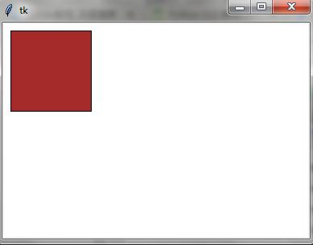

# 004. tkinter canvas

"canvas"是一个提供可以用来进行绘图的Container，支持基本的几何元素，使用Canvas进行绘图时，所有的操作都是通过Canvas，不是通过它的元素. 元素的表示可以使用handle或tag。

## 创建一个canvas程序

```python
from tkinter import *
root = Tk()
cv = Canvas(root, bg = 'white')
cv.pack()
root.mainloop()
```
>指定画布的颜色为白色


## 创建一个item

```python
from tkinter import *
root = Tk()
cv = Canvas(root, bg = "white")
cv.create_rectangle(10,10,110,110)
cv.pack()
root.mainloop()

```
>创建一个矩形


## 指定item填充色

```
from tkinter import *
root = Tk()
cv = Canvas(root, bg = "white")
cv.create_rectangle(10,10,110,110,fill = "brown")
cv.pack()
root.mainloop()
```



## 指定item边框的颜色

```python
from tkinter import *
root = Tk()
cv = Canvas(root, bg = "white")
cv.create_rectangle(10,10,110,110, outline = "red")
cv.pack()
root.mainloop()

```


## 指定边框宽度

```python
from tkinter import *
root = Tk()
cv = Canvas(root, bg = "white")
cv.create_rectangle(10,10,110,110, width = 10)
cv.pack()
root.mainloop()
```


## 画虚线

```
from tkinter import *
root = Tk()
cv = Canvas(root, bg = "white")
cv.create_rectangle(10,10,110,110, dash = 10)
cv.pack()
root.mainloop()
```


## 使用笔刷填充

```python
from tkinter import *
root = Tk()
cv = Canvas(root, bg = "white")
cv.create_rectangle(10,10,110,110, outline = "red", stipple = "gray12", fill = "green")
cv.pack()
root.mainloop()


```


## 修改item的坐标

```
from tkinter import *
root = Tk()
cv = Canvas(root, bg = "white")
block = cv.create_rectangle(10,10,110,110)
cv.pack()
cv.coords(block, 40,40,50,50)
root.mainloop()


```


