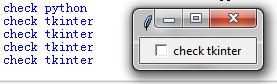
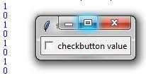
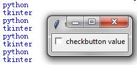

# 005. tkinter Checkbutton

## 一个简单的Checkbutton的例子

```python
from tkinter import *
root = Tk()
cb = Checkbutton(root, text = "python")
cb.pack()
root.mainloop()
```


## 设置Checkbutton的回调函数

```python
from tkinter import *
def callCheckbutton():
    print("you check this button")
root = Tk()
cb = Checkbutton(root, text = "check python", command = callCheckbutton)
cb.pack()
root.mainloop()
#不管Checkbutton的状态如何, 此回调函数都会被调用.
```


## 通过回调函数改变Checkbutton的显示文本text的值

```python
from tkinter import *
def callCheckbutton():
    #改变v的值, 即改变Checkbutton的显示值
    v.set('check tkinter')
    print(v.get())
root = Tk()
v = StringVar()
v.set('check python')
print(v.get())
Checkbutton(root, text = 'check python', textvariable = v, command = callCheckbutton).pack()

root.mainloop()
```



## 获取checkbutton的on和off的值

```python
from tkinter import *
root = Tk()
v = IntVar()
def callCheckbutton():
    print(v.get())
Checkbutton(root,variable = v, text = 'checkbutton value', command = callCheckbutton).pack()
root.mainloop()

```



```python
from tkinter import *
root = Tk()
v = StringVar()
def callCheckbutton():
    print(v.get())
Checkbutton(root,variable = v, text = 'checkbutton value', onvalue = 'python',offvalue = 'tkinter', command = callCheckbutton).pack()
root.mainloop()
```



## 其他属性

还有其他的属性fg/bg/relief/width/height/justify/state使用方法与Button相同，不再举例。


