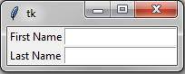
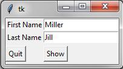

# 006. tkinter entry

## 简介:

使用 Entry 控件的语法如下: 

`w = Entry(master, option, ...)` 

`master` 参数为其父控件, 就是用来放置这个 Entry 的控件. 像其他控件一样, 我们可以在创建 Entry 控件之后再为其指定属性. 因此创建方法中的 `options` 选项可以为空. 

## 实例一:

下例为一个显示了两个 Entry 控件的应用. 一个用来输入姓氏, 一个用来输入名字. 我们用不带参数的构造方法创建 Entry.

```python
from tkinter import *
master = Tk()
Label(master, text = 'First Name').grid(row = 0)
Label(master, text = 'Last Name').grid(row = 1)
e1 = Entry(master)
e2 = Entry(master)
e1.grid(row = 0, column = 1)
e2.grid(row = 1, column = 1)
master.mainloop()
```



## 实例二:

现在我们已经创建了两个 Entry, 用户可以在这个应用中输入数据. 但我们的程序如何得到这些数据呢? 
方法很简单, 调用 Entry 类的 `get()` 方法即可. 我们改进了上面的程序, 添加了 “退出” 和 “显示” 两个按钮. 在 “显示” 按钮上, 我们绑定了 `show_entry_fields()` 函数, 该函数会调用 Entry 类的 `get()` 方法. 这样每次 “显示” 按钮被点击, Entry 控件的内容就会打印在终端里.

```python
from tkinter import *
def show_entry_fields():
    print("First Name: %s\nLast Name %s" %(e1.get(),e2.get()))
master = Tk()
Label(master, text = "First Name").grid(row = 0)
Label(master, text = "Last Name").grid(row = 1)
e1 = Entry(master)
e2 = Entry(master)
e1.insert(10,'Miller')
e2.insert(10,'Jill')
e1.grid(row = 0, column = 1)
e2.grid(row = 1, column = 1)
Button(master,text = 'Quit', command = master.quit).grid(row = 3 , column = 0, sticky = W, pady = 4)
Button(master, text = 'Show', command = show_entry_fields).grid(row = 3, column = 1, sticky = W, pady = 4)
master.mainloop()
```



如果要在每次点击 “显示” 按钮输出内容后, 将 Entry 的显示内容清空呢? 没问题! 我们可以使用 Entry 类的 `delete()` 方法. 该方法的调用方式为 `delete(first, last = None)`, 两个参数都是整型. 如果只传入一个参数, 则会删除这个数字指定位置 (index) 上的字符. 如果传入两个参数, 则表示删除从 “first” 到 “last” 指定范围内的字符. 使用 `delete(0, END)` 可以删除 Entry 控件已输入的全部字符.

## 实例三:


```python
from tkinter import *
fields = ['Last Name', 'First Name', 'Job', 'Country']

def fetch(entries):
    for entry in entries:
        field = entry[0]
        text = entry[1].get()
        print('%s: "%s"' %(field, text))
        
def makeform(root, fields):
    entries = []
    for field in fields:
        row = Frame(root)
        lab = Label(row, width = 15, text = field, anchor = 'w')
        ent = Entry(row)
        row.pack(side = TOP, fill = X, padx = 5, pady = 5)
        lab.pack(side = LEFT)
        ent.pack(side = RIGHT, expand = YES, fill = X)
        entries.append((field,ent))
return entries

if __name__ == '__main__':
    root = Tk()
    ents = makeform(root, fields)
    root.bind('<Return>',(lambda event, e=ents: fetch(e)))
    b1 = Button(root, text = 'show', command = (lambda e=ents: fetch(3)))
    b1.pack(side=LEFT, padx=5, pady=5)
    b2 = Button(root, text='quit', command=root.quit)
    b2.pack(side=LEFT,padx=5, pady=5)
    root.mainloop()
            
            


```


http://blog.csdn.net/liuxu0703/article/details/60781107


