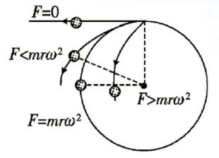
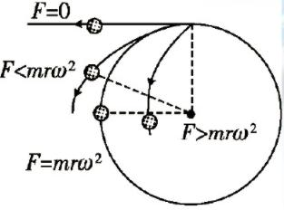
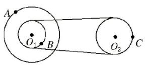
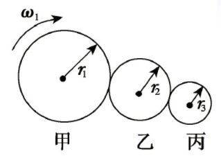
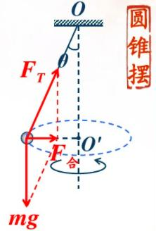

# 周期运动

[TOC]

##圆周运动

### 圆周运动的基本规律

#### 描述圆周运动的物理量及相互关系

##### 线速度

- 定义: 质点做圆周运动通过的弧长s和所用时间t的比值叫做线速度
- 大小: $v=\frac{s}{t}=\frac{2\pi r}{T}$       单位为$m/s$
- 方向: 某点线速度的方向即为该点的切线方向.(与半径方向垂直)
- 物理意义: 描述质点沿圆周运动的快慢. 对于匀速圆周运动, 在任意相等的时间内通过的弧长都相等, 即线速度大小不变, 方向时刻改变. 

##### 角速度

- 定义: 在匀速圆周运动中,连接运动质点和圆心的半径转过的角度$\varphi$跟所用时间$t$的比值, 就是质点运动的角速度。

- 大小: $\omega=\frac{\varphi}{t}=\frac{2\pi}{T}$        单位为: $rad/s$

- 物理意义: 描述质点绕圆心转动的快慢. 对于匀速圆周运动，角速度大小不变。

#####周期、频率、转速

1. 周期：做匀速圆周运动的物体，转过一周所用的时间叫做周期。用T表示

2. 频率： 做匀速圆周运动的物体在$1s$内转的圈数叫做频率。 用$f$表示，其单位为转/秒（或赫兹），符号为$r/s$(或$Hz$)。

   $f=\frac{1}{T}$    $T=\frac{2\pi r}{v}$    $\omega=\frac{2\pi}{T}=2\pi f$    $v=\omega r$
3. 转速： 工程技术中常用转速来描述转动物体上质点做圆周运动的快慢。转速是指物体单位时间内转过的圈数，常用符号$n$表示，转速的单位为转/秒，符号是$r/s$，或转/分（$r/min$）。 

#####向心加速度

- 定义：做圆周运动的物体，指向圆心的加速度称为向心加速度。
- 大小：$a=\frac{v^2}{r}=\omega^2r=\frac{4\pi^2}{T^2}r=4\pi^2f^2r=v\cdot\omega$
- 方向：沿半径指向圆心
- 意义：向心加速度的大小表示速度方向改变的快慢
- 说明：
  1.  向心加速度总指向圆心，方向始终与速度方向垂直，故向心加速度只改变速度的方向，不改变速度的大小。

  2.  向心加速度方向时刻变化，故匀速圆周运动是一种加速度变化的变加速曲线运动（或称非匀变速曲线运动）。 

  3.  向心加速度不一定是物体做圆周运动的实际加速度。对于匀速圆周运动，其所受的合外力就是向心力，只产生向心加速度，因而匀速圆周运动的向心加速度是其实际加速度。对于非匀速圆周运动，例如竖直平面内的圆周运动，小球的合力不指向圆心，因而其实际加速度也不指向圆心，此时的向心加速度只是它的一个分加速度，其只改变速度的方向。而沿切线的分加速度只改变速度的大小。

##### 向心力

- 定义：做圆周运动的物体受到的指向圆心的合外力，叫向心力。

- 方向：向心力的方向沿半径指向圆心，始终和质点运动方向垂直，即总与圆周运动的线速度方向垂直。

- 大小：$F=m\frac{v^2}{r}=m\omega^2r=m\frac{4\pi^2}{T^2}r=m4\pi^2f^2r=mv\cdot\omega$

- 向心力的效果：向心力的效果：向心力只改变线速度的方向，不改变线速度的大小。

#####离心运动和向心运动

###### 离心运动

- 定义：做圆周运动的物体，在受到的合外力突然消失或不足以提供圆周运动所需向心力的情况下，就做逐渐远离圆心的运动。

- 本质：做圆周运动的物体，由于本身的惯性，总有沿着切线方向飞出去的倾向。

- 受力特点：

  当$F=m\omega^2r$时，物体做匀速圆周运动；

  当$F=0$时， 物体沿切线方向飞出；

  当$F<m\omega^2r$时，物体逐渐远离圆心。

  $F$为实际提供的向心力。如图所示。
  

######向心运动
- 受力特点

  当提供向心力的合外力大于做圆周运动所需向心力时， 即$F>m\omega^2r$, 物体逐渐向圆心靠近。 如图所示。

#### 匀速圆周运动的两个结论:

1. 同一转动圆盘(或物体)上的各点角速度相同
2. 不打滑的摩擦传动和皮带(或齿轮)传动的两轮边缘上各点线速度大小相等。

##### 练习:

- 如图所示的皮带传动装置, 主动轮$O_1$上两轮的半径分别为$3r$和$r$, 从动轮$O_2$的半径为$2r$, $A$ 、$B$、$C$分别为轮子边缘上的三点， 设皮带不打滑，求：

  (1) $A$ 、$B$、$C$三点的角速度之比$\omega_A:\omega_B:\omega_C=\underline{\hspace{5em}}$

  (2) $A$ 、$B$、$C$三点的线速度之比$v_A:v_B:v_C=\underline{\hspace{5em}}$

> (1) $2:2:1$  (2) $3:1:1$

- 如图所示, 甲、乙、丙三个轮子依靠摩擦转动， 相互之间不打滑， 其半径分别为$r_1$、$r_2$、$r_3$ . 若甲轮的角速度为$\omega_1$, 则丙轮的角速度为$\underline{\hspace{5em}}$

> $r_1\omega_1/r_3$

#### 圆周运动中的动力学问题分析

- 向心力的来源

  向心力是按力的作用效果命名的，可以是重力、弹力、摩擦力等各种力，也可以是几个里的合力或某个力的分力，因此在受力分析中要避免再另外添加一个向心力

- 向心力的确定

  1. 确定圆周运动的轨道所在的平面，确定圆心的位置。
  2. 分析物体的受力情况，找出所有的力沿半径方向指向圆心的合力就是向心力。

##### 几种常见的匀速圆周运动

- 圆锥摆

- 转盘

- 火车转弯

- 滚筒

